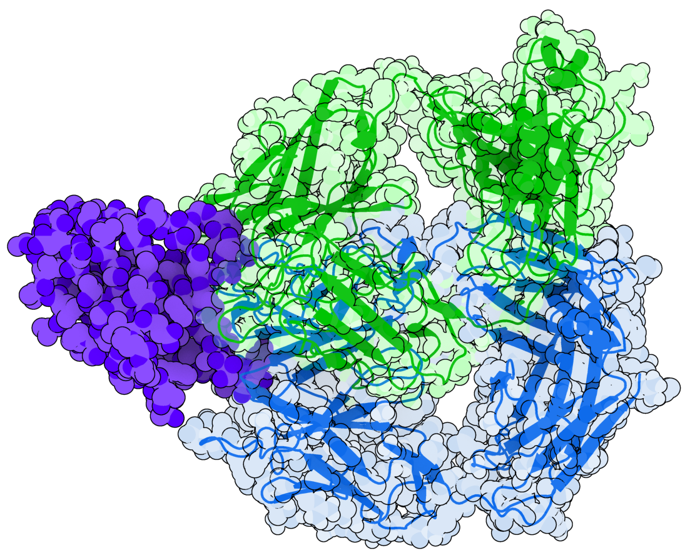

# _Pemfauxlizumab_: Pembrolizumab-like Antibody Hallucination using AlphaFold2

## Companion Repository for: [Am I Hallucinating or Can AI Now Design Cancer-Curing Antibodies?](https://medium.com/@colbyford/am-i-hallucinating-or-can-ai-now-design-cancer-curing-antibodies-3ef1bef92106)

<h3 align="right">Colby T. Ford, Ph.D.</h3>

## Process
### Structure Hallucinations
- Run [hallucinate.ipynb](hallucinate.ipynb) notebook.

### Structure Prep for Docking
- Run the steps in [data_prep.md](data_prep.md).

## Resources

- AlphaFold2-based hallucinations were performed using [ColabDesign](https://github.com/sokrypton/ColabDesign/tree/main/af) by [Sergey Ovchinnikov](https://github.com/sokrypton)
- HADDOCK 2.4 docking system in Docker: https://github.com/colbyford/HADDOCKer/tree/main/HADDOCK2.4
- Protein images were made using: https://3dproteinimaging.com/protein-imager/